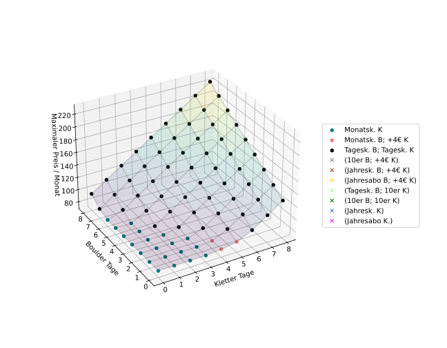
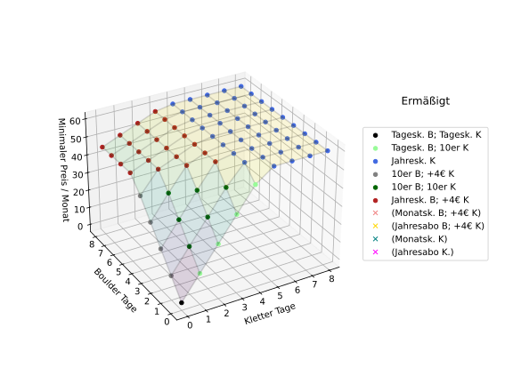

<!-- programming, blog, blog posts, samuel homberg, research, Münster, kletterbar, climbing, data science, visualization --> 
<!-- Samuel Homberg, 01.NOV.2024 -->

# Which Ticket to the Boulder Gym should I buy? 

Code available [here](https://gist.github.com/SamuelHomberg/782cb1f6f3472e18dcafc4dd1e9a7723). Text on the images is in German.

Recently I wondered which type of ticket to purchase for climbing and bouldering in the [KletterBar Münster](https://kletterbar-muenster.de/), and I found a nice way of visualizing the best tickets to purchase. The KletterBar has tickets for bouldering and climbing in several tiers: the one-day ticket ("Tageskarte"), early bird, 10 entrance card, monthly abo, yearly abo and a yearly abo that is billed monthly. Additionally there are discounts for students, children and members of the [DAV](https://www.alpenverein.de/), and if you have a boulder abo you can go climbing and only pay 4 Euros extra.

To know which type of ticket I should purchase, I first wrote function to look up the prices. I then played around (and scetched some stuff on paper) until I found a visualization giving me exaclty what I needed. Note that I didn't add the option of early bird tickets, children or family tickets.  
 

On this 3D-plot, the x- and y-axis show the number of days (in a month) you want to boulder and/or go climbing and the z-axis displays the cheapest minimal price you'll have to pay ("Minimaler Preis / Monat"). The color of the dots then shows which ticket to purchase.

While the color choices could be improved (and other marker types could be added) this visualization is really good in picking out which ticket to buy. The cheapest option (if you never go) is to just buy one-day tickets (black dot). If you only go bouldering or only go climbing, you see how often you need to go monthly to beat the 10 entrance ticket ("10er"), these are the light green (climbing) and grey (bouldering) dots. If you go climbing and bouldering at least once a month, you should at least get two 10 entrance tickets, one for bouldering and one for climbing, this are the dark green dots. At some point, the yearly tickets for bouldering or climbing are the cheapest options, while the monthly billed tickets are never the cheapest. 

Of course, if you only have half a year before you move somewhere else, it might still be better to buy the montly ticket, and the code can be easily adjusted to then display the best options (by removing the option of yearly tickets).

You can also play around with the code and show how you could pay the most amount of money to the KletterBar:

While actually using this would just be an efficient way of wasting money, this visualization makes it clear that all prices lie between the two visualized planes.

If someone from Münster actually wants to use this visualization, here are also the options for non-students and non-DAV members.

